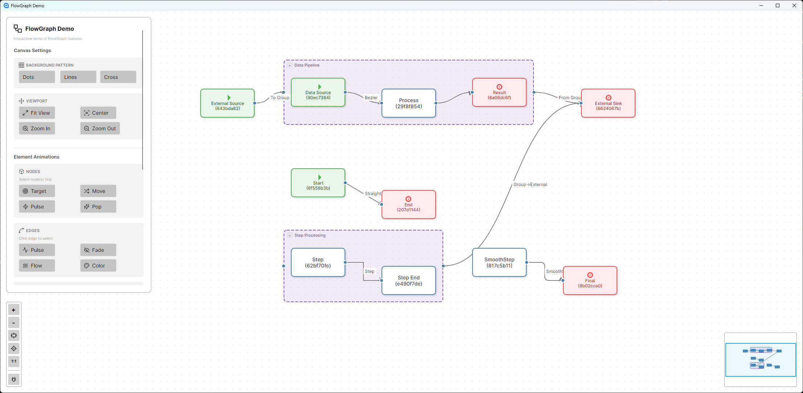

# FlowGraph

A node-based graph editor for .NET and Avalonia, inspired by [React Flow](https://reactflow.dev/).

[](https://www.nuget.org/packages/FlowGraph.Avalonia/)
[](https://dotnet.microsoft.com/)
[](https://avaloniaui.net/)
[](LICENSE)



## Features

### Core
- **Pan & Zoom** - Mouse wheel zoom, middle-click pan, configurable drag behavior
- **Node System** - Draggable, resizable, selectable nodes with custom renderers
- **Edge Types** - Bezier, Straight, Step, SmoothStep curves with arrow markers
- **Connection Validation** - Custom rules for valid connections
- **Undo/Redo** - Full command history with keyboard shortcuts
- **Clipboard** - Copy, cut, paste, duplicate operations
- **Serialization** - JSON save/load support

### Components
- **FlowMinimap** - Overview with viewport navigation
- **FlowControls** - Zoom in/out/fit buttons panel
- **FlowBackground** - Dots, lines, or cross patterns
- **NodeToolbar** - Floating toolbar on node selection
- **FlowDiagnostics** - Debug panel for development
- **FlowPanel** - Positioned overlay panels (9 positions)

### Advanced
- **Grouping** - Collapsible node groups with nesting
- **Edge Routing** - Orthogonal, bezier, and smart routing algorithms
- **Animations** - Smooth viewport, node, edge, and group animations
- **State Machine** - Clean input handling architecture
- **Edge Reconnection** - Drag edge endpoints to reconnect

## Installation

```bash
dotnet add package FlowGraph.Avalonia
```

Or via NuGet Package Manager:
```
Install-Package FlowGraph.Avalonia
```

## Quick Start

### 1. Add namespaces to your AXAML

```xml
<Window xmlns:fg="using:FlowGraph.Avalonia"
        xmlns:fgc="using:FlowGraph.Avalonia.Controls">
```

### 2. Add FlowCanvas and components

```xml
<Panel>
    <!-- Background pattern -->
    <fgc:FlowBackground x:Name="Background" Variant="Dots" Gap="20" />
    
    <!-- Main canvas -->
    <fg:FlowCanvas x:Name="Canvas" Graph="{Binding MyGraph}" />
    
    <!-- Controls panel -->
    <fgc:FlowPanel Position="BottomLeft" Margin="16">
        <fgc:FlowControls TargetCanvas="{Binding #Canvas}" />
    </fgc:FlowPanel>
    
    <!-- Minimap -->
    <fgc:FlowPanel Position="BottomRight" Margin="16">
        <fgc:FlowMinimap TargetCanvas="{Binding #Canvas}" />
    </fgc:FlowPanel>
    
    <!-- Node toolbar (appears on selection) -->
    <fgc:NodeToolbar TargetCanvas="{Binding #Canvas}" Position="Top" Offset="12">
        <StackPanel Orientation="Horizontal" Spacing="4">
            <Button Content="Delete" Click="OnDelete" />
            <Button Content="Duplicate" Click="OnDuplicate" />
        </StackPanel>
    </fgc:NodeToolbar>
</Panel>
```

### 3. Create a graph in your ViewModel

```csharp
using FlowGraph.Core;

public class MainViewModel
{
    public Graph MyGraph { get; }

    public MainViewModel()
    {
        MyGraph = new Graph();

        var inputNode = new Node
        {
            Type = "input",
            Position = new Point(100, 100),
            Outputs = [new Port { Id = "out", Type = "data" }]
        };

        var processNode = new Node
        {
            Type = "process",
            Position = new Point(300, 100),
            Inputs = [new Port { Id = "in", Type = "data" }],
            Outputs = [new Port { Id = "out", Type = "data" }]
        };

        var outputNode = new Node
        {
            Type = "output",
            Position = new Point(500, 100),
            Inputs = [new Port { Id = "in", Type = "data" }]
        };

        MyGraph.AddNode(inputNode);
        MyGraph.AddNode(processNode);
        MyGraph.AddNode(outputNode);

        MyGraph.AddEdge(new Edge
        {
            Source = inputNode.Id,
            Target = processNode.Id,
            SourcePort = "out",
            TargetPort = "in",
            Type = EdgeType.Bezier,
            MarkerEnd = EdgeMarker.Arrow
        });

        MyGraph.AddEdge(new Edge
        {
            Source = processNode.Id,
            Target = outputNode.Id,
            SourcePort = "out",
            TargetPort = "in",
            Type = EdgeType.Bezier,
            MarkerEnd = EdgeMarker.ArrowClosed
        });
    }
}
```

### 4. Connect the background (code-behind)

```csharp
public partial class MainWindow : Window
{
    public MainWindow()
    {
        InitializeComponent();
        Background.TargetCanvas = Canvas;
    }
}
```

## Configuration

```csharp
var settings = new FlowCanvasSettings
{
    // Grid
    GridSize = 20,
    SnapToGrid = true,
    ShowGrid = true,
    
    // Zoom
    MinZoom = 0.1,
    MaxZoom = 4.0,
    ZoomStep = 0.1,
    
    // Nodes
    NodeWidth = 150,
    NodeHeight = 80,
    
    // Connections
    StrictConnectionDirection = true,
    ConnectionSnapDistance = 30,
    
    // Selection
    BoxSelectionMode = BoxSelectionMode.Intersect,
    
    // Viewport
    PanOnDrag = true,
    PanOnScroll = false,
    PanOnScrollSpeed = 1.0,
    ViewportBounds = new Rect(-1000, -1000, 3000, 3000),
    ViewportBoundsPadding = 100
};

canvas.Settings = settings;
```

## Custom Node Renderers

Create custom node appearances by implementing `INodeRenderer`:

```csharp
public class CustomNodeRenderer : DefaultNodeRenderer
{
    private static readonly IBrush CustomBackground = new SolidColorBrush(Color.Parse("#E3F2FD"));
    private static readonly IBrush CustomBorder = new SolidColorBrush(Color.Parse("#2196F3"));

    public override Control CreateNodeVisual(Node node, NodeRenderContext context)
    {
        var control = base.CreateNodeVisual(node, context);
        
        if (control is Border border)
        {
            border.Background = CustomBackground;
            border.BorderBrush = CustomBorder;
            border.CornerRadius = new CornerRadius(12);
        }
        
        return control;
    }

    protected override string GetDisplayText(Node node)
    {
        return node.Data as string ?? node.Type;
    }
}

// Register the renderer
canvas.NodeRenderers.Register("custom", new CustomNodeRenderer());
```

## Connection Validation

Implement `IConnectionValidator` for custom connection rules:

```csharp
public class TypeMatchValidator : IConnectionValidator
{
    public ValidationResult Validate(ConnectionContext context)
    {
        if (context.SourceNode.Id == context.TargetNode.Id)
            return ValidationResult.Invalid("Cannot connect to self");
            
        if (context.SourcePort.Type != context.TargetPort.Type)
            return ValidationResult.Invalid("Port types must match");
            
        return ValidationResult.Valid();
    }
}

canvas.ConnectionValidator = new TypeMatchValidator();
```

## Events

```csharp
canvas.SelectionChanged += (s, e) => 
{
    Console.WriteLine($"Selected: {e.SelectedNodes.Count} nodes, {e.SelectedEdges.Count} edges");
};

canvas.ViewportChanged += (s, e) => 
{
    Console.WriteLine($"Zoom: {e.Zoom:P0}, Offset: ({e.OffsetX:F0}, {e.OffsetY:F0})");
};

canvas.NodeDragStart += (s, e) => Console.WriteLine($"Started dragging {e.Nodes.Count} nodes");
canvas.NodeDragStop += (s, e) => Console.WriteLine($"Stopped dragging");

canvas.ConnectStart += (s, e) => Console.WriteLine($"Connection started from {e.SourceNode.Type}");
canvas.ConnectEnd += (s, e) => 
{
    if (e.WasCompleted)
        Console.WriteLine("Connection created!");
    else
        Console.WriteLine("Connection cancelled");
};
```

## Keyboard Shortcuts

| Shortcut | Action |
|----------|--------|
| `Delete` / `Backspace` | Delete selected |
| `Ctrl+A` | Select all |
| `Ctrl+C` | Copy |
| `Ctrl+X` | Cut |
| `Ctrl+V` | Paste |
| `Ctrl+D` | Duplicate |
| `Ctrl+Z` | Undo |
| `Ctrl+Y` / `Ctrl+Shift+Z` | Redo |
| `Ctrl+G` | Group selected |
| `Ctrl+Shift+G` | Ungroup |
| `Escape` | Deselect all / Cancel operation |

## Animations

```csharp
// Viewport
canvas.FitToViewAnimated(duration: 0.5);
canvas.CenterOnNodeAnimated(node, duration: 0.3);
canvas.ZoomToAnimated(targetZoom: 1.5, duration: 0.2);

// Nodes
canvas.AnimateNodesTo(positions, duration: 0.3);
canvas.AnimateNodesAppear(nodes, duration: 0.3, stagger: 0.05);
canvas.AnimateNodesDisappear(nodes, duration: 0.2);
canvas.AnimateSelectionPulse(node);

// Edges
canvas.AnimateEdgePulse(edge, pulseCount: 3);
canvas.AnimateEdgeFadeIn(edge, duration: 0.3);
canvas.AnimateEdgeFadeOut(edge, duration: 0.3);
canvas.AnimateEdgeColor(edge, Colors.Red, duration: 0.5);

// Flow animation (continuous)
var animation = canvas.StartEdgeFlowAnimation(edge, speed: 50);
canvas.StopEdgeFlowAnimation(animation);

// Groups
canvas.AnimateGroupCollapse(groupId, duration: 0.5);
canvas.AnimateGroupExpand(groupId, duration: 0.5);
```

## Serialization

```csharp
using FlowGraph.Core.Serialization;

// Save/Load JSON
var json = GraphSerializer.Serialize(graph);
var graph = GraphSerializer.Deserialize(json);

// File operations
graph.SaveToFile("graph.json");
var graph = GraphExtensions.LoadFromFile("graph.json");

// Clone
var copy = graph.Clone();
```

## Node Grouping

```csharp
// Create groups
canvas.GroupSelected();
canvas.GroupSelected("My Group");

// Collapse/expand
canvas.ToggleGroupCollapse(groupId);
canvas.AnimateGroupCollapse(groupId, duration: 0.5);
canvas.AnimateGroupExpand(groupId, duration: 0.5);

// Manage nodes
canvas.GroupManager.AddNodeToGroup(groupId, nodeId);
canvas.GroupManager.RemoveNodeFromGroup(nodeId);
canvas.UngroupSelected();
```

## Edge Routing

```csharp
canvas.Settings.EnableEdgeRouting = true;
canvas.Settings.DefaultEdgeRouter = EdgeRouterType.Orthogonal;

// Available routers: Direct, Orthogonal, SmartBezier

canvas.Routing.RouteAllEdges();
canvas.Routing.RouteEdge(edgeId);
```

## Project Structure

```
FlowGraph/
├── FlowGraph.Core           # Data models, commands, serialization
├── FlowGraph.Avalonia       # Avalonia UI controls and rendering
├── FlowGraph.Demo           # Sample application
└── FlowGraph.Core.Tests     # Unit tests
```

## Requirements

- .NET 9.0 or later
- Avalonia 11.2 or later

## Contributing

Contributions are welcome. Priority areas:
- Documentation
- Unit tests
- Bug fixes
- Performance improvements

## License

MIT License - see [LICENSE](LICENSE) for details.

## Acknowledgments

- Inspired by [React Flow](https://reactflow.dev/)
- Built with [Avalonia UI](https://avaloniaui.net/)
